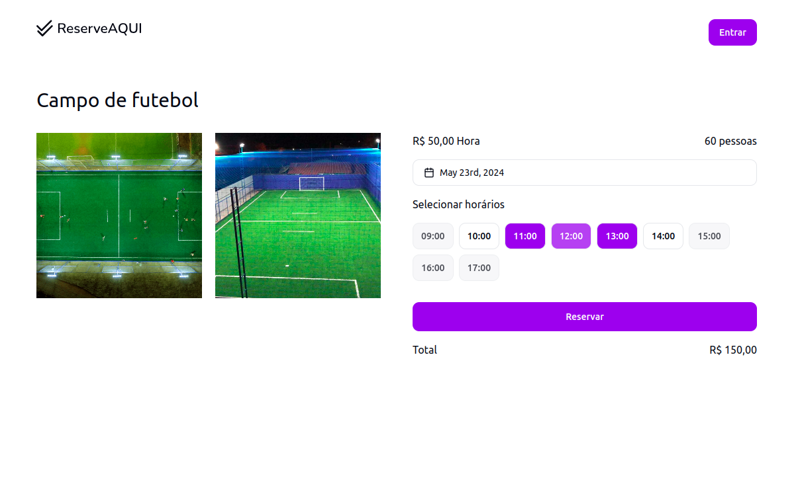

<h1 align="center">
  
</h1>

<h3 align="center">
  Aplicação de reserva de espaços online
</h3>

<p align="center">
  

  

  
</p>

<p align="center">
  
</p>

> [Visualizar live demo](https://reserve-aqui-app.vercel.app/)

## Integrantes do Grupo M

Guilherme Henrry Batista Damasceno
guilhermehenry60@gmail.com

Douglas Soares de Oliveira
soares.douglas.oliveira@hotmail.com

## Sobre

O software "Reserve Aqui" foi desenvolvido para proporcionar aos clientes
uma forma intuitiva e eficiente de reservar espaços para festas, quadras
esportivas, e outros tipos de locações. Com uma interface amigável e acessível, os
usuários podem verificar a disponibilidade dos espaços em tempo real e selecionar
os horários que melhor atendem às suas necessidades. Além disso, em caso de
imprevistos, o software permite o cancelamento da reserva de maneira simples e
rápida, garantindo flexibilidade e conveniência ao cliente. "Reserve Aqui" surge
como uma solução completa e moderna para a gestão de reservas online,
otimizando o processo tanto para os clientes quanto para os administradores dos
espaços.

## Como utilizar

Primeiro passo é clonar esse repositório

```bash
git clone https://github.com/Guihenrry/reserve-aqui.git
```

Este repositório contém aplicação backend, frontend. Por isso separei o processo de instalação para cada ambiente.

- [backend](https://github.com/Guihenrry/reserve-aqui/blob/main/backend/README.md)
- [frontend](https://github.com/Guihenrry/reserve-aqui/blob/main/frontend/README.md)

## Repositório do GitHub

Você pode encontrar o código-fonte e os arquivos relacionados a este projeto no seguinte repositório do GitHub:

https://github.com/Guihenrry/reserve-aqui
